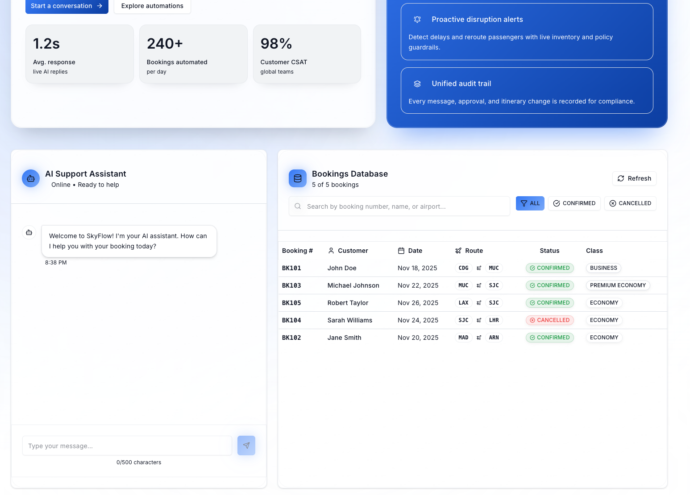

# ✈️ SkyFlow Booking Assistant

> An intelligent AI-powered customer support system for airline bookings, combining modern web technologies with enterprise-grade backend architecture.



---

## 🌟 Features

### 🤖 Intelligent AI Assistant
- **GPT-4 Turbo Integration**: Advanced natural language understanding and generation
- **Function Calling**: Direct integration with booking operations
- **Streaming Responses**: Real-time message streaming for instant feedback
- **Context-Aware**: Understands complex booking requests and maintains conversation context

### 📊 Booking Management
- **Search & Filter**: Find bookings by number, name, date, or route
- **Real-time Updates**: Live synchronization between chat actions and booking table
- **Status Tracking**: Visual indicators for confirmed and cancelled bookings
- **Class Management**: Support for Economy, Premium Economy, and Business class

### 🎨 Modern User Interface
- **Dark/Light Mode**: Seamless theme switching with system preference support
- **Responsive Design**: Optimized for mobile, tablet, and desktop
- **Glassmorphism UI**: Beautiful modern design with backdrop blur effects
- **Smooth Animations**: Polished user experience with fluid transitions

### 🔒 Business Logic
- **Policy Enforcement**: Automated validation of booking modification rules
- **Change Restrictions**: 24-hour advance notice requirement
- **Data Validation**: Comprehensive input validation and error handling
- **Exception Management**: User-friendly error messages and recovery

---

## 🏗️ Architecture

### System Overview

```
┌─────────────────────────────────────────────────────────────┐
│                       Frontend (Next.js)                     │
│  ┌──────────────┐  ┌──────────────┐  ┌──────────────┐      │
│  │  Chat UI     │  │ Bookings     │  │   Theme      │      │
│  │  Component   │  │   Table      │  │   System     │      │
│  └──────────────┘  └──────────────┘  └──────────────┘      │
│         │                  │                  │              │
│         └──────────────────┴──────────────────┘              │
│                            │                                 │
│                     API Layer (api.ts)                       │
└────────────────────────────┬────────────────────────────────┘
                             │ HTTP/REST
┌────────────────────────────┴────────────────────────────────┐
│                    Backend (Spring Boot)                     │
│  ┌─────────────────────────────────────────────────────┐    │
│  │              Controllers                             │    │
│  │   ChatController  │  BookingController               │    │
│  └────────────┬──────────────────┬─────────────────────┘    │
│               │                  │                           │
│  ┌────────────┴──────┐  ┌───────┴──────────┐               │
│  │   AI Service      │  │  Booking Service │               │
│  │  - LangChain4j    │  │  - Business Logic│               │
│  │  - GPT-4 Turbo    │  │  - Validations   │               │
│  │  - Tool Calling   │  │  - Policy Checks │               │
│  └───────────────────┘  └────────┬──────────┘               │
│                                  │                           │
│                         ┌────────┴──────────┐                │
│                         │   Repository      │                │
│                         │   - In-Memory DB  │                │
│                         └───────────────────┘                │
└──────────────────────────────────────────────────────────────┘
```

### Backend Architecture

**Layer Structure:**
- **Controllers**: REST API endpoints with proper HTTP semantics
- **Services**: Business logic, AI orchestration, validation
- **Repositories**: Data access abstraction (in-memory implementation)
- **DTOs**: Clean data transfer between layers
- **Models**: Domain entities with business rules
- **Exception Handlers**: Centralized error management

**AI Integration:**
- LangChain4j for AI orchestration
- Function calling for booking operations
- Streaming chat responses
- Context management for conversations

### Frontend Architecture

**Component Structure:**
- **Pages**: Next.js 15 App Router structure
- **Components**: Reusable UI components with shadcn/ui
- **Lib**: API client and utility functions
- **Styles**: Tailwind CSS v4 with CSS variables for theming

**State Management:**
- React hooks for local state
- Real-time updates via callback props
- Optimistic UI updates for better UX

---

## 🚀 Quick Start

### Prerequisites

- **Java 21** or higher
- **Node.js 18** or higher
- **npm** or **yarn**
- **OpenAI API Key**

### Installation

1. **Clone the repository**
```bash
git clone https://github.com/yourusername/Booking-Chatbot.git
cd Booking-Chatbot
```

2. **Set up environment variables**
```bash
# Create .env file in the project root
echo "OPENAI_API_KEY=your_api_key_here" > .env
```

3. **Start the application**
```bash
make start
```

This will:
- Start the Spring Boot backend on `http://localhost:8080`
- Start the Next.js frontend on `http://localhost:3000`
- Open your browser automatically

### Alternative Manual Setup

**Backend:**
```bash
./mvnw spring-boot:run
```

**Frontend:**
```bash
cd frontend
npm install
npm run dev
```

---

## 📖 Usage

### Chatting with the AI Assistant

The AI assistant can help you with:

1. **View Booking Details**
   - "Show me booking 102"
   - "What are the details of my flight?"

2. **Modify Bookings**
   - "Change my flight date to November 25"
   - "Update destination to Paris"
   - "Upgrade to Business class"

3. **Cancel Bookings**
   - "Cancel booking 103"
   - "I want to cancel my flight"

4. **General Inquiries**
   - "What are your terms and conditions?"
   - "How can I change my booking?"
   - "What classes are available?"

### Business Rules

⚠️ **Important Restrictions:**
- Changes must be made at least 24 hours before departure
- Cancelled bookings cannot be modified
- All modifications are subject to availability

---

## 🔧 Configuration

### Backend Configuration

Edit `src/main/resources/application.properties`:

```properties
# Server Configuration
server.port=8080

# AI Configuration
langchain4j.open-ai.chat-model.api-key=${OPENAI_API_KEY}
langchain4j.open-ai.chat-model.model-name=gpt-4-turbo-preview
langchain4j.open-ai.chat-model.temperature=0.7
langchain4j.open-ai.chat-model.log-requests=true
langchain4j.open-ai.chat-model.log-responses=true
```

### Frontend Configuration

Edit `frontend/next.config.ts`:

```typescript
const config = {
  env: {
    NEXT_PUBLIC_API_URL: process.env.NEXT_PUBLIC_API_URL || 'http://localhost:8080',
  },
};
```

---

## 🎨 Customization

### Theming

The application supports both light and dark modes with full customization via CSS variables in `frontend/app/globals.css`:

```css
:root {
  --background: 0 0% 100%;
  --foreground: 222 47% 11%;
  --primary: 217 91% 60%;
  /* ... more variables ... */
}

.dark {
  --background: 222 47% 11%;
  --foreground: 210 40% 98%;
  --primary: 217 91% 65%;
  /* ... more variables ... */
}
```

### Branding

Update the application name and branding in:
- `frontend/app/layout.tsx` - Page title and metadata
- `frontend/app/page.tsx` - Main header and footer
- `frontend/components/chat.tsx` - Welcome message

---

## 🛠️ Tech Stack

### Backend
- **Framework**: Spring Boot 3.3.3
- **Language**: Java 21
- **AI/ML**: LangChain4j 0.35.0
- **AI Model**: OpenAI GPT-4 Turbo
- **Build Tool**: Maven
- **Testing**: JUnit 5, Mockito

### Frontend
- **Framework**: Next.js 15 (App Router)
- **Language**: TypeScript 5
- **Styling**: Tailwind CSS v4
- **UI Components**: shadcn/ui
- **Icons**: Lucide React
- **State Management**: React Hooks
- **Theme**: next-themes

### DevOps
- **Development**: Hot reload for both frontend and backend
- **Build**: Makefile for unified commands
- **Environment**: .env for configuration

---

## 📋 API Documentation

### Chat Endpoint

**POST** `/api/chat`

Stream chat responses with AI assistant.

```typescript
// Request
{
  "chatId": "unique-chat-id",
  "message": "Show me booking 102"
}

// Response (Server-Sent Events)
data: Hello!
data:  I'll
data:  help
data:  you
data:  with
data:  that.
```

### Bookings Endpoints

**GET** `/api/bookings`

Get all bookings.

```json
[
  {
    "bookingNumber": "102",
    "firstName": "Jane",
    "lastName": "Smith",
    "date": "2024-11-20",
    "from": "JFK",
    "to": "LHR",
    "bookingClass": "PREMIUM_ECONOMY",
    "bookingStatus": "CONFIRMED"
  }
]
```

**PUT** `/api/bookings/{bookingNumber}`

Modify a booking.

```json
// Request
{
  "date": "2024-11-25",
  "from": "JFK",
  "to": "CDG",
  "bookingClass": "BUSINESS"
}

// Response: Updated booking object
```

**DELETE** `/api/bookings/{bookingNumber}`

Cancel a booking.

---

## 🧪 Testing

### Backend Tests

```bash
# Run all tests
./mvnw test

# Run specific test class
./mvnw test -Dtest=BookingServiceTest

# With coverage
./mvnw clean test jacoco:report
```

### Frontend Tests

```bash
cd frontend

# Run linter
npm run lint

# Type check
npm run type-check
```

---

## 📦 Building for Production

### Backend

```bash
./mvnw clean package
java -jar target/booking-chatbot-0.0.1-SNAPSHOT.jar
```

### Frontend

```bash
cd frontend
npm run build
npm start
```

### Docker (Optional)

```bash
# Build and run with Docker Compose
docker-compose up --build
```

---

## 🤝 Contributing

Contributions are welcome! Please follow these steps:

1. Fork the repository
2. Create a feature branch (`git checkout -b feature/AmazingFeature`)
3. Commit your changes (`git commit -m 'Add some AmazingFeature'`)
4. Push to the branch (`git push origin feature/AmazingFeature`)
5. Open a Pull Request

---

## 📄 License

This project is licensed under the MIT License - see the [LICENSE](LICENSE) file for details.

---

## 🙏 Acknowledgments

- **OpenAI** for GPT-4 Turbo API
- **LangChain4j** for Java AI orchestration
- **Vercel** for Next.js framework
- **shadcn/ui** for beautiful UI components
- **Tailwind CSS** for utility-first styling

---


<div align="center">
  <p>Built with ❤️ using Spring Boot and Next.js</p>
</div>
# SkyFlow-AI
# SkyFlow-AI
# SkyFlow-AI
# SkyFlow-AI
